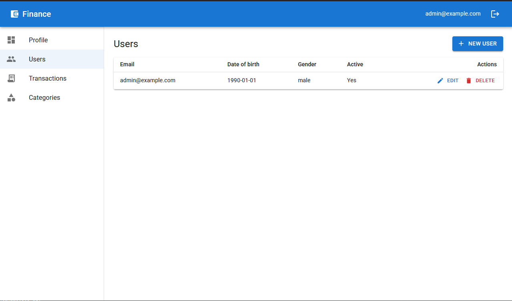
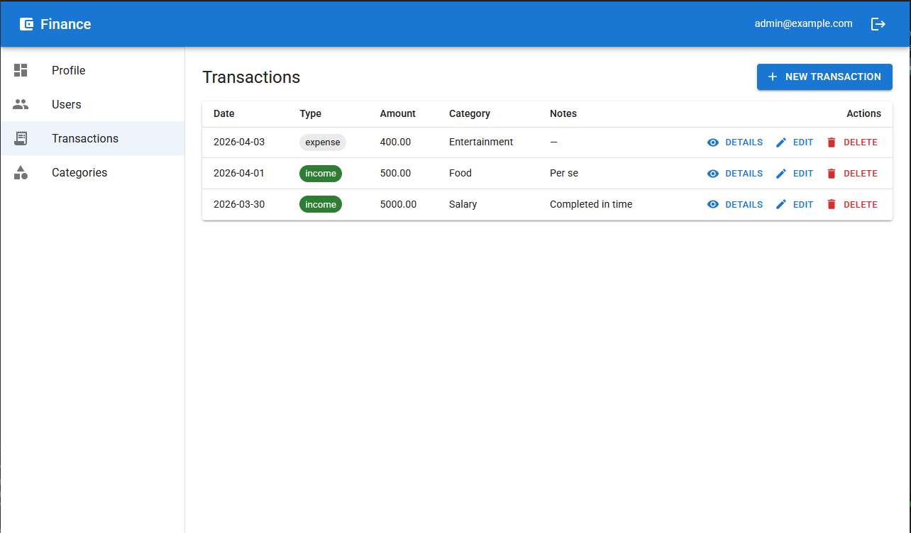

# 📝 Project Documentation: Finance Data Processing Backend

## 🚀 Overview
This solution is a robust, typed, and secure backend for finance data processing. It is designed with a **Simplicity-First** approach, prioritizing clear architectural patterns that are ready to be "swapped" for high-scale production components as the system grows.

---

## 🛠️ Tech Stack
* **Runtime:** Node.js (v24+)
* **Language:** TypeScript (Strict Mode)
* **Framework:** Express.js
* **ORM:** TypeORM (Data Mapper Pattern)
* **Database:** SQLite (Relational, chosen for portability and zero-config simplicity)
* **Security:** JSON Web Tokens (JWT), Bcrypt Hashing, Express-Rate-Limit
* **Testing:** Jest & Supertest (Integration Testing)

---

## 🏛️ 1. User and Role Management
The system implements a structured identity model to manage access levels.
* **Current State:** We use a **Static Administration Model**. Roles (Admin, Analyst, Viewer) and their associated permissions are defined within the codebase.
* **Why:** This keeps authorization logic predictable and easy to audit during the initial phase.
* **Production Alternative:** In a live environment, we would implement **Dynamic RBAC**, allowing Admin users to create custom roles and map granular permissions (e.g., `get_transactions`) directly in the database.

## 💰 2. Financial Records Management
Full CRUD support for financial transactions with advanced data navigation.
* **Implemented Features:**
    * **Advanced Filtering:** Users can filter records by date ranges, categories, and transaction types.
    * **Pagination:** Record listing is paged to ensure the UI remains responsive as the database scales.
* **Persistence:** We use **SQLite** for data storage. 
* **Alternatives:** SQLite was chosen for its simplicity. For high concurrency or horizontal scaling, we would migrate to **PostgreSQL** or **MySQL** to leverage row-level locking and optimized connection pooling.

## 📊 3. Dashboard Summary APIs
The backend provides aggregated insights for a bird's-eye view of financial health.
* **Current State:** Summaries (Total Income, Expenses, Trends) are **computed on-the-fly** using SQL aggregations via TypeORM QueryBuilder.
* **Productive Alternative:** **Caching or Pre-aggregation**. 
* **The Path Forward:** For high-traffic apps, we would use a separate `Summaries` table updated via database triggers, or a **Redis cache** with a 5-minute TTL to serve data in constant time ($O(1)$).

## 🛡️ 4. Access Control Logic (RBAC)
Access control is enforced via a "Waterfall" middleware strategy.
* **JWT Authentication:** Secure, stateless access is handled via **JSON Web Tokens**. Upon login, the user's ID and Role are encoded into a signed token, allowing the backend to verify identity without constant database lookups.
* **Role Behavior:**
    * **Viewer:** Strictly limited to the dashboard; blocked from viewing individual transaction rows.
    * **Analyst:** "Read-Only" access to records and summaries; cannot modify data.
    * **Admin:** Full management access over both records and user accounts.
* **Implementation:** Handled via a custom `authorize` guard and `express-rate-limit` middleware to protect against brute-force attacks.

## ⚠️ 5. Validation and Error Handling
The API follows a "Fail-Fast" philosophy to ensure data integrity.
* **Input Validation:** Proper handling of incorrect or incomplete input (e.g., negative amounts or invalid categories).
* **Status Codes:** Uses appropriate HTTP codes (`400`, `401`, `403`, `404`) for meaningful client feedback.
* **Automated Testing:** A full suite of **Jest** integration tests confirms that validation, authentication, and role restrictions work as expected before any code is deployed.

---

## 📡 API Reference

### 🔐 Authentication
| Method | Endpoint | Description | Access |
| :--- | :--- | :--- | :--- |
| `POST` | `/api/auth/login` | Exchange email/password for a signed JWT. | Public |

### 👤 User Management
| Method | Endpoint | Description | Access |
| :--- | :--- | :--- | :--- |
| `GET` | `/api/users/me` | Returns profile of current authenticated user. | All |
| `GET` | `/api/users` | Lists all users (Supports Pagination). | Admin |
| `POST` | `/api/users` | Creates a new user with a specified role. | Admin |
| `PUT` | `/api/users/:id` | Updates user details, role, or active status. | Admin |
| `DELETE` | `/api/users/:id` | Permanently removes a user from the system. | Admin |

### 💸 Financial Records (Transactions)
| Method | Endpoint | Description | Access |
| :--- | :--- | :--- | :--- |
| `GET` | `/api/transactions` | List records with **Filtering & Paging**. | Admin, Analyst |
| `POST` | `/api/transactions` | Creates a new income or expense entry. | Admin |
| `GET` | `/api/transactions/:id` | Retrieves a single transaction record by ID. | Admin |
| `PATCH` | `/api/transactions/:id` | Partially updates an existing transaction. | Admin |
| `DELETE` | `/api/transactions/:id` | Removes a financial record. | Admin |

### 📊 Dashboard & Metadata
| Method | Endpoint | Description | Access |
| :--- | :--- | :--- | :--- |
| `GET` | `/api/dashboard` | Returns global totals (Income, Expense, Balance). | All |
| `GET` | `/api/dashboard/summary` | Category-wise breakdown of totals. | All |
| `GET` | `/api/dashboard/trends` | Time-series data for financial trends. | All |
| `GET` | `/api/categories` | Lists all available transaction categories. | All |

---

## 🔍 Query Parameters (Pagination & Filtering)
Both `GET /api/users` and `GET /api/transactions` support advanced query parameters:

| Parameter | Type | Description |
| :--- | :--- | :--- |
| `page` / `limit` | `number` | Offset-based pagination (e.g., `?page=1&limit=10`). |
| `sortBy` / `sortOrder` | `string` | Comma-separated fields (e.g., `?sortBy=date,amount&sortOrder=DESC,ASC`). |
| `withTotalCount` | `boolean` | If `true`, returns total record count for pagination UI. |

### **Transaction-Specific Filters**
* `amountMin` / `amountMax`: Numeric range.
* `dateStart` / `dateEnd`: ISO date strings.
* `categoryIds`: Comma-separated UUIDs (e.g., `?categoryIds=id1,id2`).
* `type`: `income` | `expense`.

### **User-Specific Filters**
* `email`: Partial match search.
* `gender`: `male` | `female` | `other`.
* `isActive`: `true` | `false`.
* `dateOfBirthStart` / `dateOfBirthEnd`: Age range filtering.

---

## 📈 Future Enhancements (Roadmap)
The following professional functionalities are targeted for future releases:

| Feature | Implementation & Impact |
| :--- | :--- |
| **Database Migrations** | Transition from `sync: true` to versioned migration files for safe production schema updates. |
| **API Versioning** | Implement `/api/v1/` prefixing to prevent breaking changes for external clients. |
| **Soft Delete** | Add a `deletedAt` timestamp to enable "Undo" functionality and audit trails. |
| **Structured Logging** | Integrate **Winston** or **Pino** to persist logs for accountability and debugging. |

---

## 🏗️ Architecture Strengths
1.  **Layered Responsibility:** Separation between Routes, Controllers, and Repositories ensures the code is easy to navigate.
2.  **Scalable Foundations:** The code structure allows SQLite and On-the-fly math to be replaced with PostgreSQL and Caching layers without changing core business logic.
3.  **Type Safety:** Built with **TypeScript**, catching errors at compile-time and serving as living documentation.
4.  **Security-First:** Authorization is integrated directly into the routing layer via "Waterfall" middleware.

